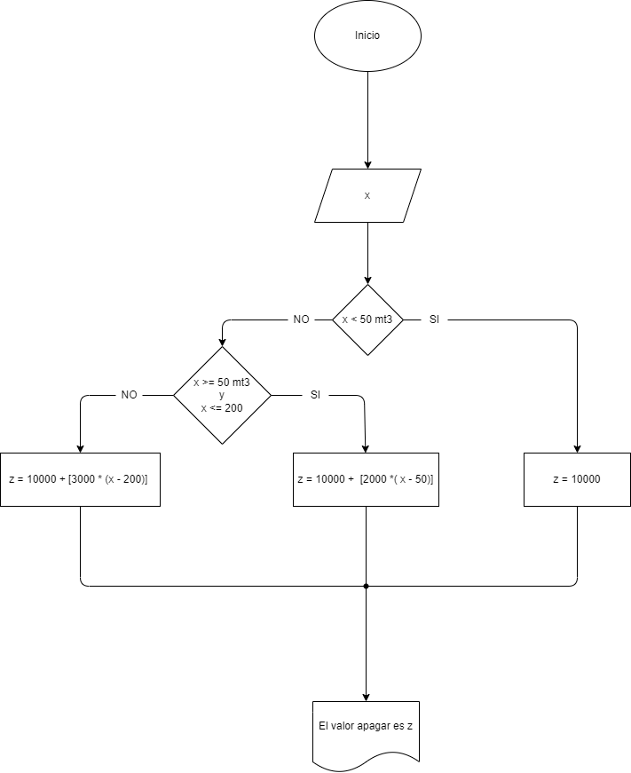

calcular el gasto de agua de una vivienda dado el numero de metros cubicos gastados, siendo el sistema de cobro el siguiente: 
-la cuota fija mensual es de 10.000 pesos
-los primeros 50 metros cubicos son gratis
-entre 50 y 200 metros cubicos se cobra el metro cubico a 2000 pesos
-apartir del 200 se cobra el metro cubico 3000 pesos

